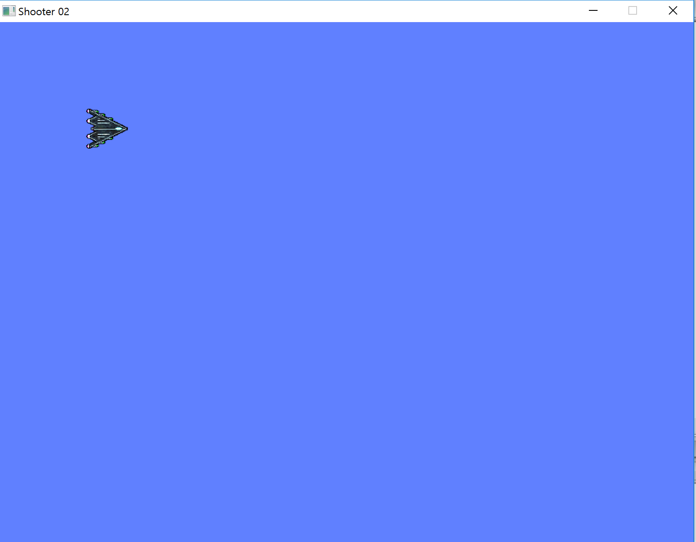
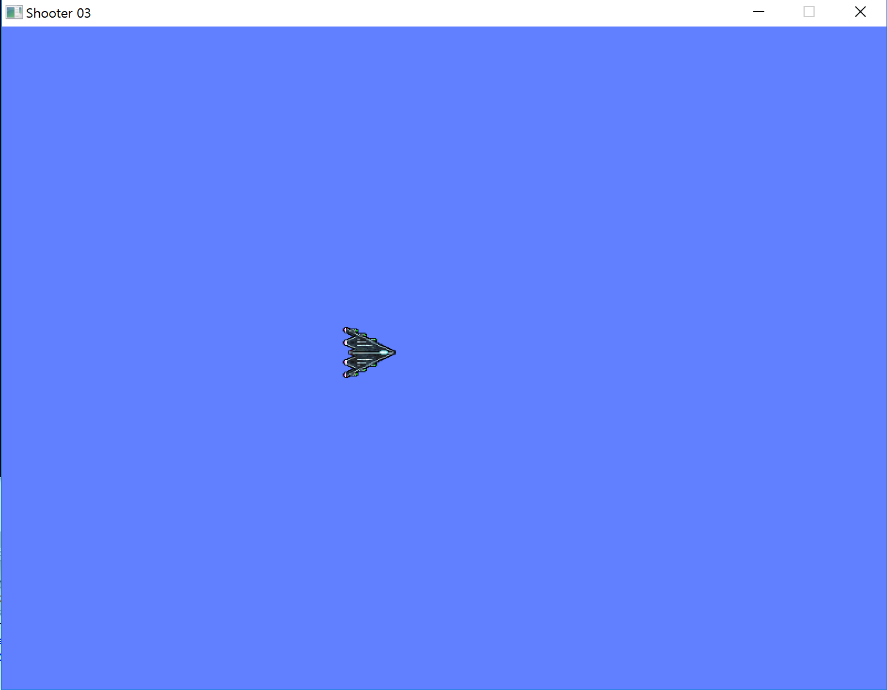
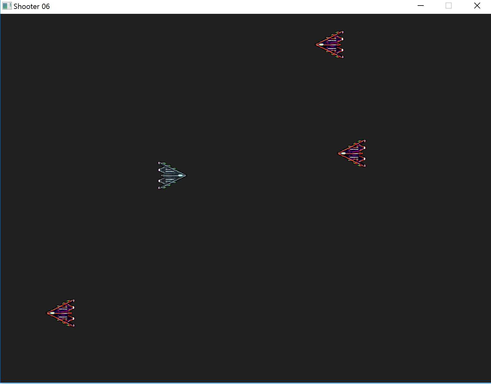

# 2D Shoot 'Em Up Tutorials
This is a shooting game.

There are a little change of the original source code using a mingw32 gcc with a code::blocks .

check the origianl tutorial [site](https://www.parallelrealities.co.uk/tutorials/#shooter)

Here are some screen shots for the game.

## Part 1: Opening a window

no image

## Part 2: Drawing the player
<!------> 

## Part 3: Moving the player

<!------> 

## Part 4: Firing a bullet
<!--- ---> 

## Part 5: Refactoring
<!--- ---> 

## Part 6: Enemies
<!--- ---> 

## Part 7: Shooting enemies
<!--- ---> 

