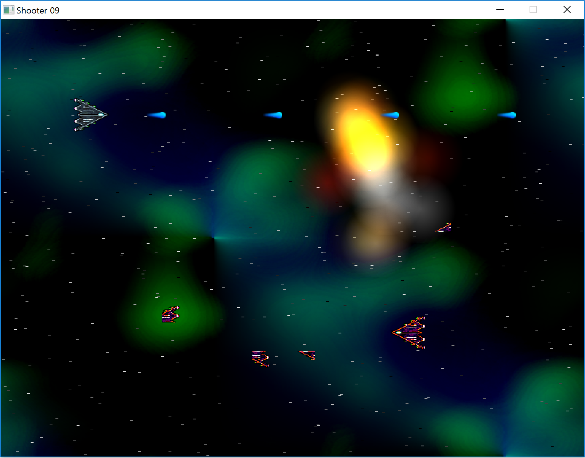
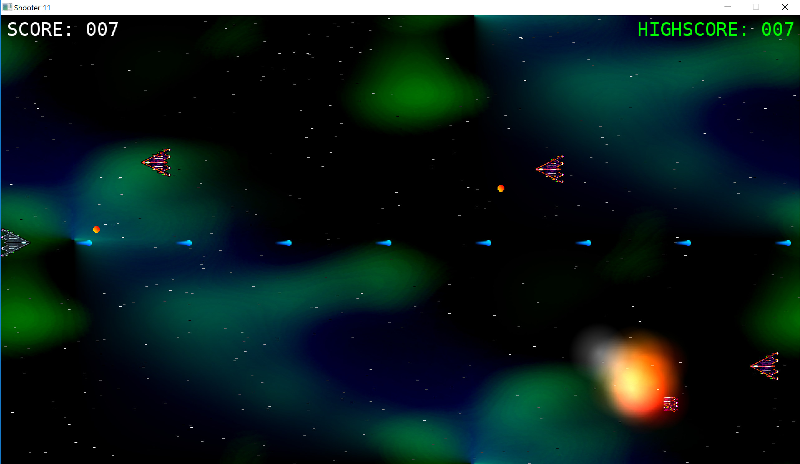
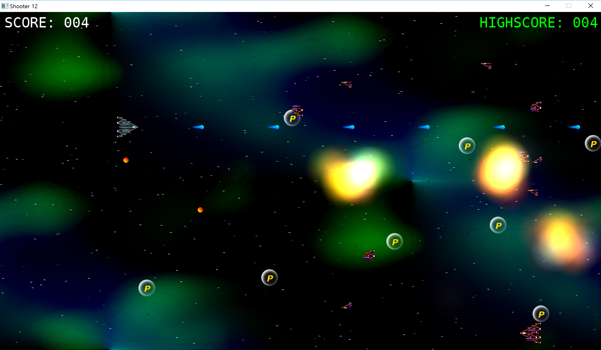
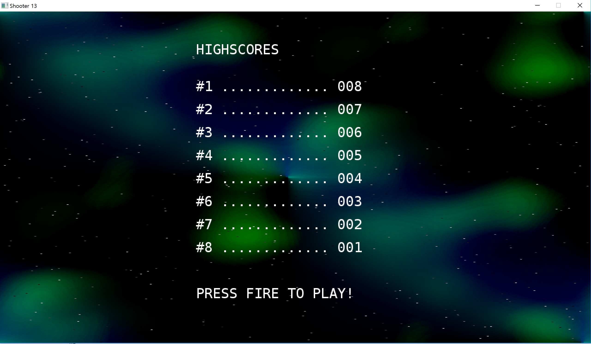
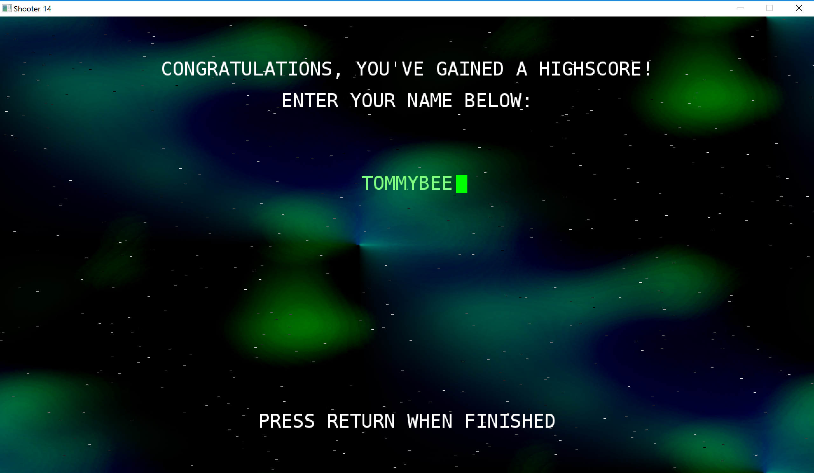
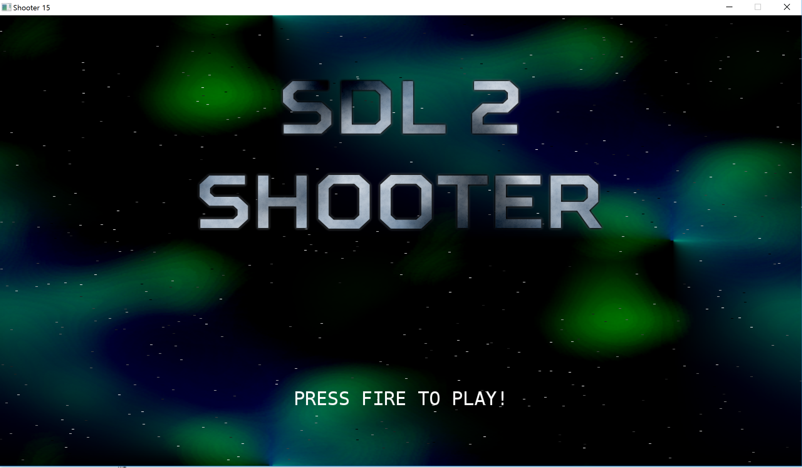

# 2D Shoot 'Em Up Tutorials
This is a shooting game.

There are a little change of the original source code using a mingw32 gcc with a code::blocks .

check the origianl tutorial [site](https://www.parallelrealities.co.uk/tutorials/#shooter)

Here are some screen shots for the game.

## Part 1: Opening a window 
no image

[My blog in korean translation](https://blog.naver.com/tommybee/221584372479)

[Author blog](https://www.parallelrealities.co.uk/tutorials/shooter/shooter1.php)

## Part 2: Drawing the player
<!------> 

[My blog in korean translation](https://blog.naver.com/tommybee/221585560010) 

[Author blog](https://www.parallelrealities.co.uk/tutorials/shooter/shooter2.php)

## Part 3: Moving the player
<!------> 

[My blog in korean translation](https://blog.naver.com/tommybee/221585590488) 

[Author blog](https://www.parallelrealities.co.uk/tutorials/shooter/shooter3.php)

## Part 4: Firing a bullet
<!--- ---> 

[My blog in korean translation](https://blog.naver.com/tommybee/221586502343) 

[Author blog](https://www.parallelrealities.co.uk/tutorials/shooter/shooter4.php)

## Part 5: Refactoring
<!--- ---> 

[My blog in korean translation](https://blog.naver.com/tommybee/221592674215) 

[Author blog](https://www.parallelrealities.co.uk/tutorials/shooter/shooter5.php)

## Part 6: Enemies
<!--- ---> 

[My blog in korean translation](https://blog.naver.com/tommybee/221593675846) 

[Author blog](https://www.parallelrealities.co.uk/tutorials/shooter/shooter6.php)

## Part 7: Shooting enemies
<!--- ---> 

[My blog in korean translation](https://blog.naver.com/tommybee/221595608282)

[Author blog](https://www.parallelrealities.co.uk/tutorials/shooter/shooter7.php)

## Part 8: Enemies fighting back!
<!--- ---> 

[My blog in korean translation](https://blog.naver.com/tommybee/221596696195) 

[Author's blog](https://www.parallelrealities.co.uk/tutorials/shooter/shooter8.php)

## Part 9: Effects and background graphics
<!--- ---> 

[My blog in korean translation](https://blog.naver.com/tommybee/221596730735) 

[Author's blog](https://www.parallelrealities.co.uk/tutorials/shooter/shooter9.php)

## Part 10: Sound and music
<!--- ---> 

[My blog in korean translation](https://blog.naver.com/tommybee/221598329827) 

[Author's blog](https://www.parallelrealities.co.uk/tutorials/shooter/shooter10.php)

## Part 11: Bitmap font rendering
<!--- ---> 

[My blog in korean translation](https://blog.naver.com/tommybee/221599451931) 

[Author's blog](https://www.parallelrealities.co.uk/tutorials/shooter/shooter11.php)

## Part 12: Points Pods
<!--- ---> 

[My blog in korean translation](https://blog.naver.com/tommybee/221601459172) 

[Author's blog](https://www.parallelrealities.co.uk/tutorials/shooter/shooter12.php)

## Part 13: Highscore table (Part 1)
<!--- ---> 

[My blog in korean translation](https://blog.naver.com/tommybee/221601459172) 

[Author's blog](https://www.parallelrealities.co.uk/tutorials/shooter/shooter13.php)

## Part 14: Highscore table (Part 2)
<!--- ---> 

[My blog in korean translation](https://blog.naver.com/tommybee/221602695917) 

[Author's blog](https://www.parallelrealities.co.uk/tutorials/shooter/shooter14.php)

## Part 15: Title screen and finishing touches
<!--- ---> 

[My blog in korean translation](https://blog.naver.com/tommybee/221602711268) 

[Author's blog](https://www.parallelrealities.co.uk/tutorials/shooter/shooter15.php)
