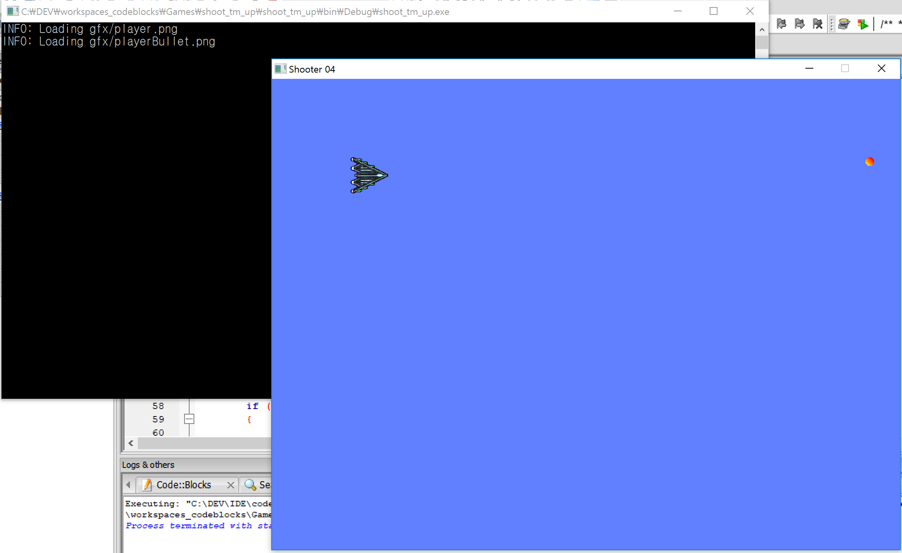
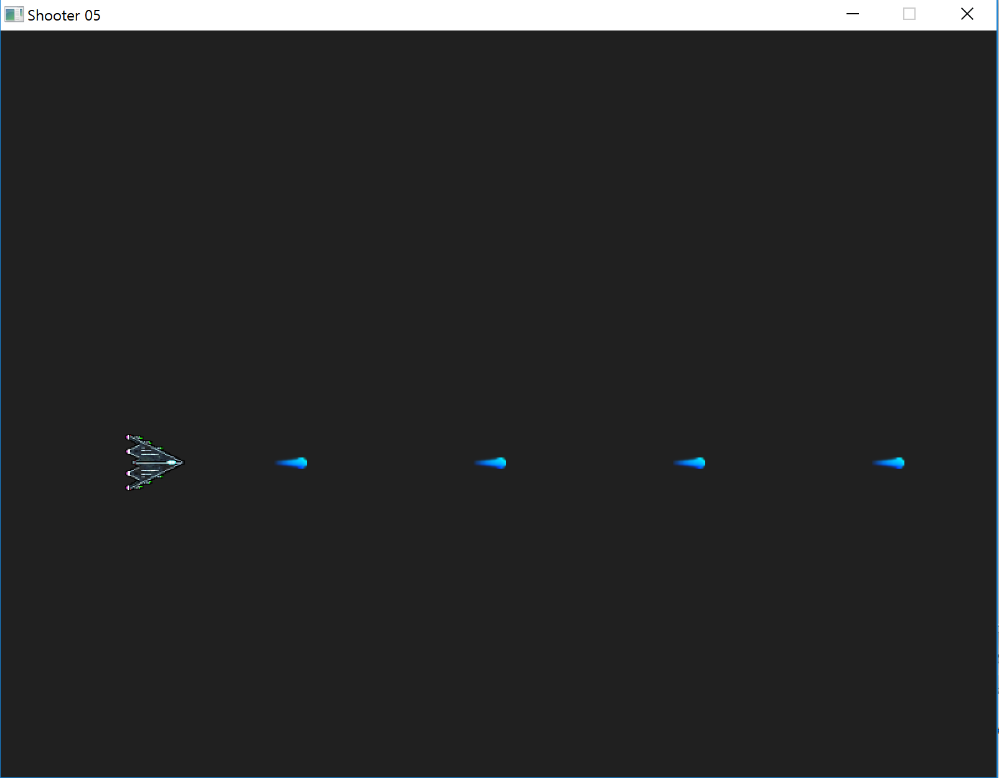

# 2D Shoot 'Em Up Tutorials
This is a shooting game.

There are a little change of the original source code using a mingw32 gcc with a code::blocks .

check the origianl tutorial site.[site](https://www.parallelrealities.co.uk/tutorials/#shooter)

## Part 1: Opening a window

 

## Part 2: Drawing the player

 

## Part 3: Moving the player

 

## Part 4: Firing a bullet

 

## Part 5: Refactoring

 

## Part 6: Enemies

 